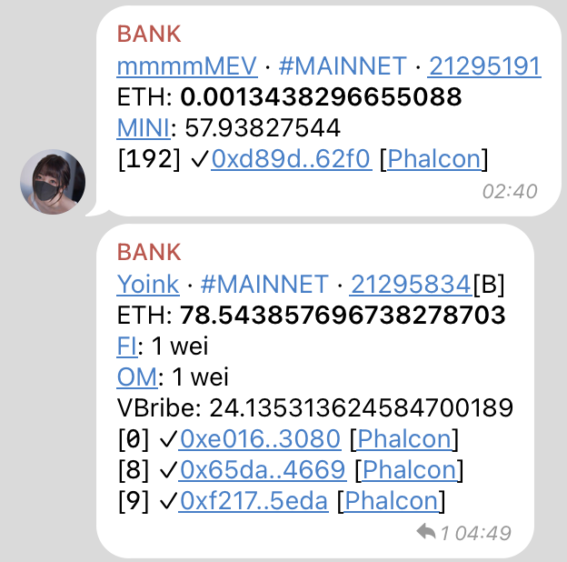
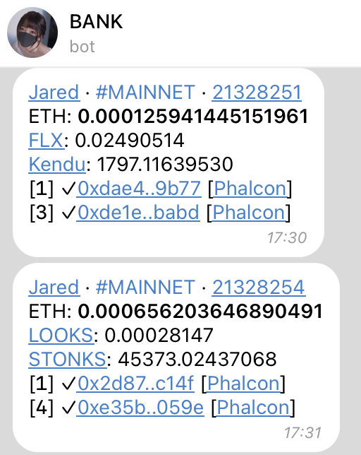

# Wallet Watcher
A tool for monitoring transaction PnL across multiple wallets with Telegram notifications. While primarily designed for MEV bot performance analysis, it has been battle-tested on Ethereum Mainnet.

When working on other chains, flaws are expected and please report them via Github issue so that other users can be awared and benefit from the fix.

Key Features:
* Multiple transactions in a single block (eg. sandwich, tx and builder payment)
* Builder reward calculation

Note: The program requires `debug_traceBlockByNumber` to be enabled on your node.

### Usage
Make your own copy of [config.example.yaml](./config.example.yaml) and fill in the details. Then run the program:

```
cargo run --release config.yaml
```

### Notification Examples


